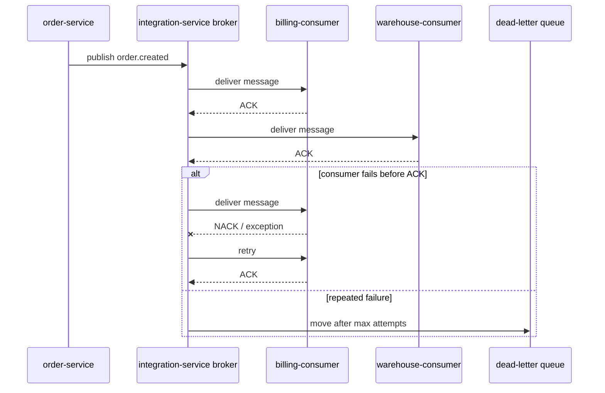

# Sequence Diagram

```mermaid
sequenceDiagram
    participant Producer as order-service
    participant Broker as integration-service broker
    participant Billing as billing-consumer
    participant Warehouse as warehouse-consumer
    participant DLQ as dead-letter queue

    Producer->>Broker: publish order.created
    Broker->>Billing: deliver message
    Billing-->>Broker: ACK
    Broker->>Warehouse: deliver message
    Warehouse-->>Broker: ACK

    alt consumer fails before ACK
        Broker->>Billing: deliver message
        Billing--xBroker: NACK / exception
        Broker->>Billing: retry
        Billing-->>Broker: ACK
    else repeated failure
        Broker->>DLQ: move after max attempts
    end
```
